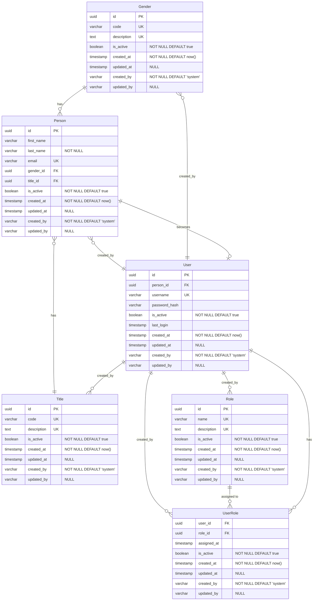

# CLAUDE.md

This file provides guidance to Claude Code (claude.ai/code) when working with code in this repository.

## Development Commands

### Java environment
The project uses Java 21 and GraalVM, so you must run the following in a terminal before running Maven or Quarkus:
```bash
sdk use java 21.0.2-graalce 
```

### Start Development Server
```bash
quarkus dev
```
- Browse to http://localhost:8080/
- DevUI at http://localhost:8080/q/dev/
- Swagger UI at http://localhost:8080/q/swagger-ui/

### Build and Test
```bash
quarkus build --clean
```

### Run Tests
```bash
./mvnw test
```

### Run Single Test
```bash
./mvnw test -Dtest=TestClassName
```

### Native Build
```bash
quarkus build --native --clean
```

### Upgrade Quarkus
```bash
quarkus upgrade
quarkus dev --clean
```

## Architecture Overview

This is a Quarkus + HTMX scaffold application following a layered architecture pattern:

### Core Stack
- **Quarkus 3.22.3** with Java 21
- **PostgreSQL** database with Flyway migrations
- **Hibernate ORM with Panache** for data persistence
- **Qute** templating engine for server-side rendering
- **HTMX** for dynamic frontend interactions
- **JAX-RS REST** for API endpoints

### Package Structure
- `domain/` - Entity classes using Panache Active Record pattern
- `resource/` - REST API endpoints (`/api/*` paths)
- `web/` - HTML UI controllers (`/*-ui` paths) using Qute templates
- `repository/` - Data access layer with custom queries
- `util/` - Utility classes like TemplateConfig for template variables
- `dto/` - Data transfer objects
- `service/` - Business logic layer
- `health/` - Health check endpoints

### Dual API Pattern
The application provides both REST API and HTML UI for the same entities:
- **REST Resources** (`resource/` package): JSON API endpoints at `/api/*`
- **Web Routers** (`web/` package): HTML UI endpoints at `/*-ui` with Qute templates

### Database Configuration
- Uses profile-based configuration (`%dev`, `%test`, `%prod`)
- Flyway migrations in `src/main/resources/db/migration/`
- Environment variables for database credentials (e.g., `DEV_DB_USERNAME`)
- Automatic clean/migrate on startup in dev/test modes

### Template System
- Qute templates in `src/main/resources/templates/`
- CheckedTemplate pattern for type-safe template references
- TemplateConfig utility provides common variables (current year, app version)
- Follows directory structure matching template organization

### Entity Pattern
Entities use Hibernate Panache Active Record pattern:
- Extend `PanacheEntity` for auto-generated ID
- Business logic methods directly on entity classes
- Repository classes for complex queries and sorting

### Form Handling
- HTML forms use `@FormParam` for parameter binding
- HTMX returns partial HTML fragments for dynamic updates
- Error handling returns appropriate HTTP status codes

### Entity Relationship Diagram

