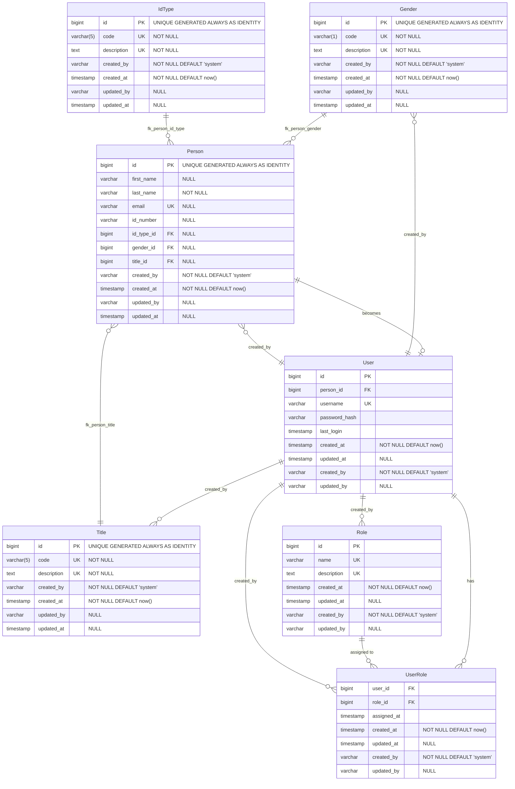

# CLAUDE.md

This file provides guidance to Claude Code (claude.ai/code) when working with code in this repository.

## Development Commands

### Start Development Server
```bash
quarkus dev
```
- Browse to http://localhost:8080/
- DevUI at http://localhost:8080/q/dev/
- Swagger UI at http://localhost:8080/q/swagger-ui/

### Build and Test
```bash
quarkus build --clean
```

### Run Tests
```bash
./mvnw test
```

### Run Single Test
```bash
./mvnw test -Dtest=TestClassName
```

### Format Code
```bash
./mvnw spotless:apply
```
(Note: Only if Spotless plugin is configured)

### Integration Tests
```bash
./mvnw verify
```

### E2E Tests (Selenide)
```bash
# Run all e2e tests (requires dev server running on localhost:8080)
./mvnw test -Dtest="**/e2e/**/*Test"

# Run specific e2e test class
./mvnw test -Dtest=HomePageNavigationTest

# Run e2e tests with browser visible (non-headless)
./mvnw test -Dtest="**/e2e/**/*Test" -Dselenide.headless=false

# Run all tests (unit + e2e)
./mvnw test

# If no e2e tests match pattern, ignore the error
./mvnw test -Dtest="**/e2e/**/*Test" -Dsurefire.failIfNoSpecifiedTests=false
```
**Note**: E2E tests require the dev server to be running on http://localhost:8080

### Native Build
```bash
quarkus build --native --clean
```

### Upgrade Quarkus
```bash
quarkus upgrade
quarkus dev --clean
```

## Architecture Overview

This is a Quarkus + HTMX scaffold application following a layered architecture pattern:

### Core Stack
- **Quarkus 3.22.3** with Java 17
- **PostgreSQL** database with Flyway migrations
- **Hibernate ORM with Panache Repository Pattern** for data persistence
- **Qute** templating engine for server-side rendering
- **HTMX** for dynamic frontend interactions
- **Quarkus REST** (REST-Easy Reactive) for API endpoints

### Package Structure
- `domain/` - Plain JPA entity classes with validation annotations
- `repository/` - Data access layer implementing PanacheRepository pattern
- `service/` - Business logic layer with transaction management and validation
- `resource/` - REST API endpoints (`/api/*` paths)
- `web/` - HTML UI controllers (`/*-ui` paths) using Qute templates
- `util/` - Utility classes like TemplateGlobals for global template variables
- `health/` - Health check endpoints (currently empty, uses Quarkus SmallRye Health)

### Dual API Pattern
The application provides both REST API and HTML UI for entities:
- **REST Resources** (`resource/` package): JSON API endpoints at `/api/*`
- **Web Routers** (`web/` package): HTML UI endpoints at `/*-ui` with Qute templates
- **Full Implementation**: Gender, Title, IdType, Person entities
- **Repository Pattern**: Clean separation between data access and business logic

### Database Configuration
- Uses profile-based configuration (`%dev`, `%test`, `%prod`)
- Flyway migrations in `src/main/resources/db/migration/`
- Environment variables for database credentials:
  - `DEV_DB_USERNAME`, `DEV_DB_PASSWORD` (development)
  - `TEST_DB_USERNAME`, `TEST_DB_PASSWORD` (testing)
  - `PROD_DB_USERNAME`, `PROD_DB_PASSWORD` (production)
- Automatic clean/migrate on startup in dev/test modes
- **Note**: Create `.env` file in project root with database credentials (not committed to git)

### Template System
- Qute templates in `src/main/resources/templates/`
- CheckedTemplate pattern for type-safe template references
- TemplateGlobals utility provides common variables (current year, app version)
- Follows directory structure matching template organization
- Refer to https://quarkus.io/guides/qute-reference for guidance on templates

### Entity Pattern
Entities use Plain JPA with Panache Repository pattern:
- Pure JPA entities with no inheritance from Panache classes
- Focus solely on data structure with validation annotations
- Repository classes implementing `PanacheRepository<Entity>` handle all database operations
- Service layer manages business logic and explicit timestamp updates
- Audit fields: `created_at`, `updated_at`, `created_by`, `updated_by`
- Manual timestamp management in service layer for better control
- Refer to https://quarkus.io/guides/hibernate-orm-panache#solution-2-using-the-repository-pattern

### Form Handling
- HTML forms use `@FormParam` for parameter binding
- HTMX returns partial HTML fragments for dynamic updates
- Error handling returns appropriate HTTP status codes
- Jakarta Bean Validation for form validation
- Bootstrap styling with responsive design

### Entity Relationship Diagram


## Current Implementation Status

### ✅ Completed Features
- **Repository Pattern Architecture**: Full migration from Active Record to Repository pattern
- **Gender Entity**: Complete CRUD operations with REST API and HTML UI
- **Title Entity**: Complete CRUD operations with REST API and HTML UI
- **IdType Entity**: Complete CRUD operations with REST API and HTML UI
- **Person Entity**: Complete CRUD operations with REST API and HTML UI
- **Database Setup**: PostgreSQL with Flyway migrations
- **Template System**: Qute templates with HTMX integration
- **Development Environment**: Hot reload, DevUI, Swagger documentation
- **Clean Architecture**: Proper separation of concerns across all layers

### 🚧 In Progress / Planned
- **User Management**: User, Role, UserRole entities and authentication
- **Security**: Authentication and authorization implementation
- **Additional Features**: As defined in entity relationship diagram

### 🏗️ Architecture Benefits Achieved
- **Repository Pattern**: Clean separation between entities and data access
- **Plain JPA Entities**: Focused solely on data structure and validation
- **Explicit Transaction Management**: Manual timestamp updates in service layer
- **Better Testability**: Repository interfaces can be mocked for unit testing
- **Dual API Pattern**: REST + HTML UI established for all entities
- **Audit Trail**: Consistent audit fields across all entities
- **Exception Handling**: Proper HTTP status codes and error responses
- **Form Validation**: Jakarta Bean Validation with custom business rules
- **Bootstrap Responsive Design**: Mobile-first UI implementation
- **HTMX Dynamic Interactions**: Seamless partial page updates

## Screenshot Location
- Look in folder /home/geraldo/Pictures/Screenshots/ for screenshots

## Test Strategy
- **Resource Testing**: Comprehensive strategy documented in `docs/resource-test-strategy.md`
- **Reference Implementation**: Follow the `GenderResourceTest` pattern for all new REST resource tests
- **Framework**: Use @QuarkusTest with @TestTransaction for database rollback and REST Assured for API testing
- **Test Coverage**: CRUD operations, validation rules, error handling, and data processing scenarios
- **Data Isolation**: Use unique test data per test method to prevent conflicts
- **Documentation**: https://quarkus.io/guides/getting-started-testing
- **Database**: PostgreSQL as defined in %test.quarkus.datasource with credentials from .env file
- **E2E Testing**: Use Selenide for end-to-end browser testing
- **UI Testing**: Cover critical user journeys across different browsers and screen sizes
 
## HTMX Documentation
- HTMX documentation is here: https://htmx.org/docs/

