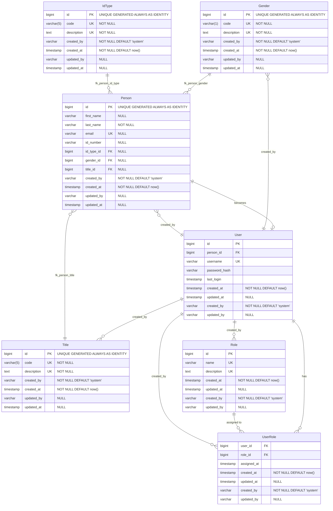

# Data Entity Documentation 

## Entity Relationship Diagram

```mermaid
erDiagram
    Gender {
        bigint id PK "UNIQUE GENERATED ALWAYS AS IDENTITY"
        varchar(1) code UK "NOT NULL"
        text description UK "NOT NULL"
        varchar created_by "NOT NULL DEFAULT 'system'"
        timestamp created_at "NOT NULL DEFAULT now()"
        varchar updated_by "NULL"
        timestamp updated_at "NULL"
    }
    
    Title {
        bigint id PK "UNIQUE GENERATED ALWAYS AS IDENTITY"
        varchar(5) code UK "NOT NULL"
        text description UK "NOT NULL"
        varchar created_by "NOT NULL DEFAULT 'system'"
        timestamp created_at "NOT NULL DEFAULT now()"
        varchar updated_by "NULL"
        timestamp updated_at "NULL"
    }
    
    IdType {
        bigint id PK "UNIQUE GENERATED ALWAYS AS IDENTITY"
        varchar(5) code UK "NOT NULL"
        text description UK "NOT NULL"
        varchar created_by "NOT NULL DEFAULT 'system'"
        timestamp created_at "NOT NULL DEFAULT now()"
        varchar updated_by "NULL"
        timestamp updated_at "NULL"
    }
    
    Person {
        bigint id PK "UNIQUE GENERATED ALWAYS AS IDENTITY"
        varchar first_name "NULL"
        varchar last_name "NOT NULL"
        varchar email UK "NULL"
        varchar id_number "NULL"
        bigint id_type_id FK "NULL"
        bigint gender_id FK "NULL"
        bigint title_id FK "NULL"
        varchar created_by "NOT NULL DEFAULT 'system'"
        timestamp created_at "NOT NULL DEFAULT now()"
        varchar updated_by "NULL"
        timestamp updated_at "NULL"
    }
    
    User {
        bigint id PK
        bigint person_id FK
        varchar username UK
        varchar password_hash
        timestamp last_login
        timestamp created_at "NOT NULL DEFAULT now()"
        timestamp updated_at "NULL"
        varchar created_by "NOT NULL DEFAULT 'system'"
        varchar updated_by "NULL"
    }
    
    Role {
        bigint id PK
        varchar name UK
        text description UK
        timestamp created_at "NOT NULL DEFAULT now()"
        timestamp updated_at "NULL"
        varchar created_by "NOT NULL DEFAULT 'system'"
        varchar updated_by "NULL"
    }
    
    UserRole {
        bigint user_id FK
        bigint role_id FK
        timestamp assigned_at
        timestamp created_at "NOT NULL DEFAULT now()"
        timestamp updated_at "NULL"
        varchar created_by "NOT NULL DEFAULT 'system'"
        varchar updated_by "NULL"
    }
    
    Gender ||--o{ Person : "fk_person_gender"
    Title ||--o{ Person : "fk_person_title"
    IdType ||--o{ Person : "fk_person_id_type"
    Person ||--o| User : "becomes"
    User ||--o{ UserRole : "has"
    Role ||--o{ UserRole : "assigned to"
    User ||--o{ Gender : "created_by"
    User ||--o{ Title : "created_by"
    User ||--o{ Person : "created_by"
    User ||--o{ Role : "created_by"
    User ||--o{ UserRole : "created_by"
```

