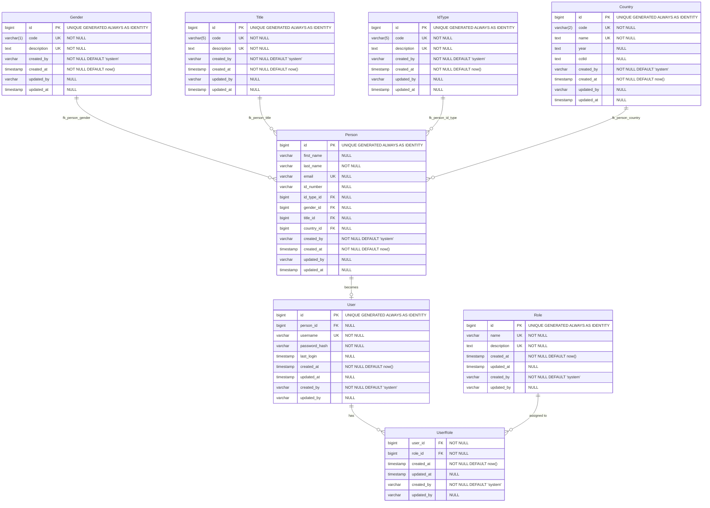

# Domain Entities Documentation

This document provides comprehensive documentation for all domain entities in the Rescaffold application, including their relationships, validation rules, and database structure.

## Overview

The application implements a comprehensive domain model with 7 core entities that support user management, person records, and lookup data. All entities follow consistent patterns for audit trails, validation, and relationships.

## Entity Categories

### Core Entities
- **Person**: Primary entity representing individuals in the system
- **User**: Authentication entity linked to Person records
- **Role**: Authorization entity for access control

### Lookup Entities
- **Gender**: Single character gender codes
- **Title**: Personal titles and honorifics
- **IdType**: Identification document types
- **Country**: ISO country codes and metadata

## Entity Relationship Diagram

## Data Patterns

### Audit Trail Pattern
All entities implement consistent audit fields:
- `created_at` (LocalDateTime, non-null): Record creation timestamp
- `created_by` (String, defaults to "system"): User who created the record
- `updated_at` (LocalDateTime, nullable): Last modification timestamp
- `updated_by` (String, nullable): User who last modified the record

### Validation Pattern
- **Jakarta Bean Validation** annotations on all fields
- **Custom patterns** for codes (uppercase, specific lengths)
- **Unique constraints** on business-critical fields (codes, descriptions)
- **Size limitations** appropriate for each field type
- **Pattern matching** for structured data (email, codes)

### Relationship Pattern
- **Lazy loading** for all ManyToOne relationships (performance optimization)
- **Eager loading** for security-critical relationships (User-Role)
- **Proper foreign key mappings** with explicit `@JoinColumn` annotations
- **Optional relationships** where business rules allow null references

### Code Normalization Pattern
- **Uppercase enforcement** for all code fields
- **Trimming** of whitespace in service layer
- **Validation before normalization** ensures proper format

## Database Schema Details

### Primary Keys
- All entities use `BIGINT` auto-generated identity columns
- PostgreSQL `GENERATED ALWAYS AS IDENTITY` for optimal performance

### Indexes
- **Primary keys**: Automatic B-tree indexes
- **Unique constraints**: Automatic unique indexes on code and description fields
- **Foreign keys**: Indexes on all foreign key columns for join performance

### Constraints
- **NOT NULL**: Required fields enforced at database level
- **UNIQUE**: Business uniqueness enforced on codes and descriptions
- **FOREIGN KEY**: Referential integrity enforced for all relationships
- **CHECK**: Pattern validation enforced at database level where applicable

### Data Types
- **Identifiers**: `BIGINT` for all IDs
- **Codes**: `VARCHAR` with specific lengths (1, 2, 5 characters)
- **Descriptions**: `TEXT` for unlimited length descriptions
- **Timestamps**: `TIMESTAMP` for all date/time fields
- **Audit fields**: `VARCHAR` for created_by/updated_by

## Migration Strategy

### Flyway Scripts
Database schema managed through Flyway migrations in `src/main/resources/db/migration/`:
- `V1.1__Create_gender_table.sql`
- `V1.2__Create_title_table.sql`
- `V1.3__Create_id_type_table.sql`
- `V1.4__Create_country_table.sql`
- `V1.5__Create_person_table.sql`
- `V1.6__Create_user_login_table.sql`
- `V1.7__Create_role_table.sql`
- `V1.8__Create_user_role_table.sql`

### Seed Data
Initial reference data populated during migration for:
- Standard gender codes (M, F, X)
- Common titles (MR, MS, MRS, DR, PROF)
- Standard ID types (ID, PASS, DL)
- ISO country codes and names

## API Integration

### REST Endpoints
Each entity provides full CRUD operations via REST API:
- `GET /api/{entities}` - List all records
- `GET /api/{entities}/{id}` - Get by ID
- `GET /api/{entities}/code/{code}` - Get by code (for lookup entities)
- `POST /api/{entities}` - Create new record
- `PUT /api/{entities}/{id}` - Update existing record
- `DELETE /api/{entities}/{id}` - Delete record

### HTML UI
Each entity provides web interface via Qute templates:
- `GET /{entities}-ui` - List view with search and pagination
- `GET /{entities}-ui/create` - Creation form
- `GET /{entities}-ui/{id}/edit` - Edit form
- `GET /{entities}-ui/{id}` - Detail view
- `POST /{entities}-ui/{id}/delete` - Delete confirmation

## Security Considerations

### Access Control
- **Lookup entities**: Read access for authenticated users, write access for admin/manager roles
- **Person entities**: Full access for admin, limited access for users
- **User/Role entities**: Admin-only access for user management

### Data Protection
- **Password security**: BCrypt hashing, never store plain text
- **Audit trails**: Complete change tracking for compliance
- **Input validation**: Multiple layers (client, server, database)
- **SQL injection prevention**: Parameterized queries via JPA

---

**Last Updated**: July 2025  
**Schema Version**: V1.8  
**Entity Count**: 7 core entities + 1 join table